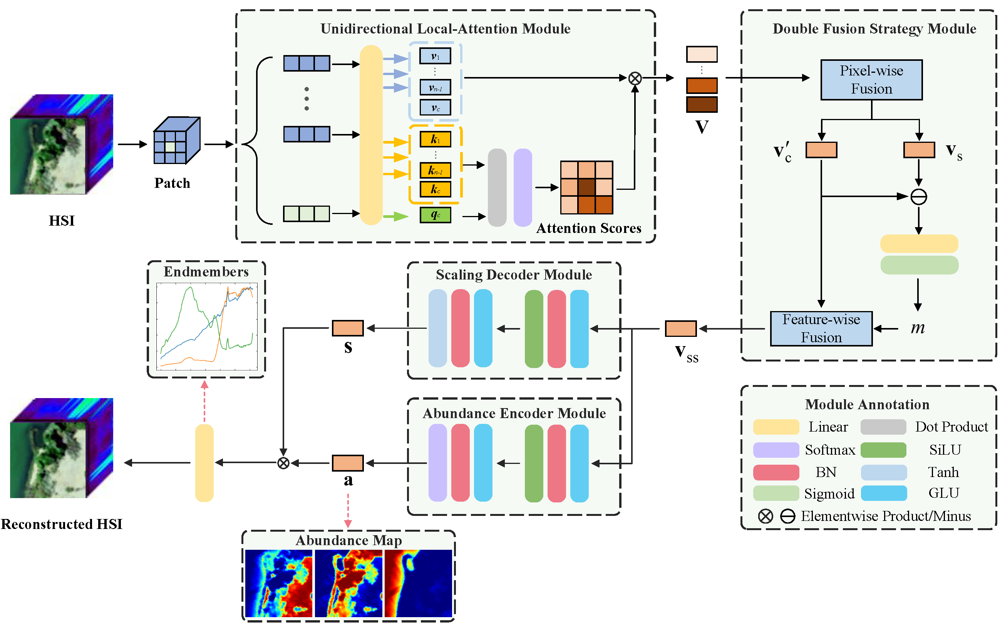

# ULA-Net Reproduction

Demo / reproduction code for:

**Unidirectional Local-Attention Autoencoder Network for Spectral Variability Unmixing**  
(IEEE TGRS, 2024, doi: [10.1109/TGRS.2024.3375598](https://doi.org/10.1109/TGRS.2024.3375598))

The authors released the network definition in `ULA.py`. This repository extends it into a full training pipeline aligned with the paper:

1. VCA endmember initialization  
2. Local `K×K` patch encoding (ULA + DFS)  
3. ELMM scaling decoder  
4. Loss = squared-sine reconstruction + `L1/2` abundance sparsity + gate regularization  
5. AdamW training + aRMSE / eSAD evaluation + visualization  



## Project layout

```text
configs/                 # experiment YAML (synthetic / Samson / Jasper Ridge)
data/                    # raw datasets + synthetic cache (see data/README.md)
ula_net/
  models/ula_net.py      # cleaned model (from ULA.py)
  data/                  # synthetic, real loaders, VCA, patches
  losses.py / metrics.py
  train.py / evaluate.py / visualize.py
scripts/                 # CLI entry points
outputs/                 # checkpoints, metrics, figures
ULA.py                   # original author file (kept for reference)
```

## Setup

```bash
cd ULA-Net-main
pip install -r requirements.txt
```

## Quick start (synthetic, no external data)

```bash
# generate scene
python scripts/generate_synthetic.py --config configs/synthetic.yaml

# train (paper uses 100 epochs; use fewer for a smoke test)
python scripts/train.py --config configs/synthetic.yaml --epochs 5 --run-name smoke

# evaluate + visualize
python scripts/evaluate.py --config configs/synthetic.yaml --checkpoint outputs/synthetic/smoke/best.pt
python scripts/visualize.py --run-dir outputs/synthetic/smoke
```

## Real datasets (Samson / Jasper Ridge)

1. Download `.mat` files and place them under:
   - `data/raw/samson/`
   - `data/raw/jasper_ridge/`
2. Follow field-name conventions in [`data/README.md`](data/README.md).
3. Train:

```bash
python scripts/train.py --config configs/samson.yaml
python scripts/train.py --config configs/jasper_ridge.yaml
```

## Default hyperparameters (paper Table I)

| Item | Synthetic | Real |
|------|-----------|------|
| `alpha` (sparsity) | `5e-3` | `1e-1` |
| `beta` (gate) | `1e-2` | `1e-2` |
| `epsilon` (scale range) | `0.2` | `0.2` |
| optimizer | AdamW, `lr=6e-3` | same |
| schedule | `×0.99` every 20 epochs | same |
| epochs / batch | 100 / 100 | 100 / 100 |
| `patch_size` (K) | 5 (configurable) | 5 |

## Citation

```bibtex
@ARTICLE{10464351,
  author={Xiang, Shu and Li, Xiaorun and Ding, Jigang and Chen, Shuhan and Hua, Ziqiang},
  journal={IEEE Transactions on Geoscience and Remote Sensing},
  title={Unidirectional Local-Attention Autoencoder Network for Spectral Variability Unmixing},
  year={2024},
  volume={62},
  pages={1-15},
  doi={10.1109/TGRS.2024.3375598}
}
```
